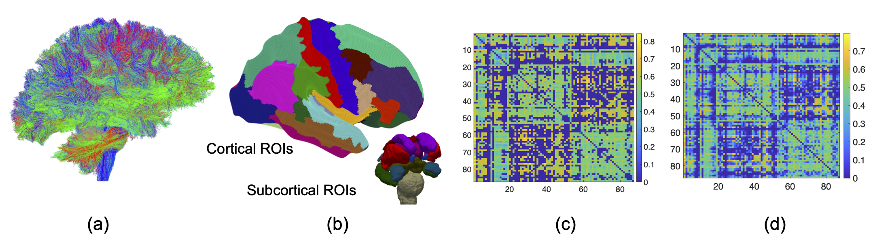

# Network-Response-Shrinkage-Model

This repository contains code and data to reproduce the NRSS (network response structural shrinkage) method proposed in "**Genetic underpinnings of brain structural connectome for young adults**" by Y. Zhao, C. Chang, J. Zhang, Z. Zhang in https://arxiv.org/abs/2212.00967. 
 
 - `run_data_simulation.R` contains the script for simulating data described in **Section 5 Simulations** of NRSS paper;
 
 - `run_simulation_rank1.R` contains the script for reproducing Simulation 1 with rank 1 coefficient for each signal SNP. 
 
 - `run_simulation_rank2.R` contains the script for reproducing Simulation 1 with rank 3 coefficient for each signal SNP. 
 
 - `run_realdata.R` contains the script for conducting real data analysis using HCP-YA brain network and genetic data. Note that due to constraints in DUA, we can't share the genetic data from HCP-YA. So the genetic data for running `run_realdata.R` are simulated. 
 
 - Code for Simulation 2 is not shared since 1) the script is similar to `run_realdata.R`; and 2) it utilizes the real genetic data which can not be released. 
 

# HCP Connectome Data Preprocessing
For each subject in HCP-YA, we download their dMRI and T1 data from the DB Connectome website (https://db.humanconnectome.org/). We then use the PSC pipeline (https://github.com/zhengwu/PSC_Pipeline.git) to preprocess the dMRI and T1 data to extract the FA connectivity matrix. The following figure shows an example of tractography result in (a),  Desikan parcellation  in (b) and   FA connectivity matrix  according to the Desikan parcellation in (c), from a single HCP-YA subject. Panel (d) shows the population mean connectivity from all HCP-YA subjects.

**Network Data:** Here we released the HCP-YA FA connectivity matrices used in `HCP-YA/HCP_networkdata.mat` (matlab file). This mat file contains data from 1064 HCP-YA subjects. There are three variables inside:

- `X_measure` (12 *1065): this contains 12 variables for each subject. The first two are age and gender. The remaining ones are cognition-related variables. 

- `all_id` (1*1065): subject ids. 

- `all_network` (87*87*1065): Network adjacency matrices (87*87) for 1065 HCP subjects. 

Matlab script `prepare_hcpbrainnetwork.m` will preprocess the network data in `HCP_networkdata.mat` and organize them into a format that can be used by `run_realdata.R` for running NRSS model. 

**Network Data Visualization:** 

To reproduce the network visualizations in the paper (adjacency matrix and circle plot), one can use matlab scripts in the folder `HCP-YA/network_visualization`. The script `plot_brain_network.m` contains code examples for showing adjacency matrix and network circle plot. 

# Genetic Data Preprocessing
The HCP-YA genetic data were download from The database of Genotypes and Phenotypes (dbGaP). Unfortunately, according to the data usage term, we can't share the raw data. We shared our preprocessing script in `HCP-YA/HCP_SNP_Preprocessing.R`. The preprocessing steps include:

- Excluding subjects with more than $10\%$ missing SNPs
- removing SNPs with larger than $5\%$ missing values, minor allele frequency
smaller than $5\%$, and Hardy-Weinberg equilibrium Pvalue less than $1\times 10^{-6}$. 
- The resulting genotype data is further processed by a linkage disequilibrium (LD)-based pruning with a window size 100, step size 10 and $r^2$ threshold 0.2, which leaves 130,452 SNPs in our analyses. 
- To determine block structure among genotypes, we start from an initial SNP with a putative block of size 100 and considering sub-blocks by gradually downsizing from 100 until more than 50\% of elements in the corresponding correlation matrix with $r^2$ surpassing 0.02. Eventually, the 130,452 SNPs are partitioned into 23,418 SNP-sets.  
